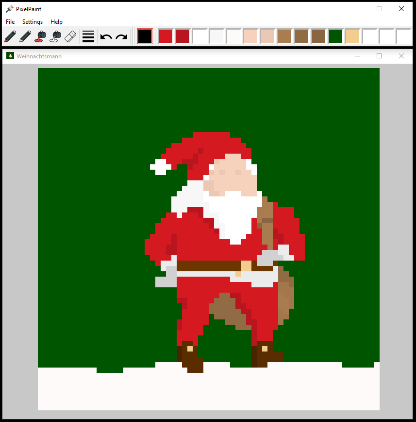

A pixel level drawing program (for Windows) - made with Python. 
[Download releases](https://github.com/JCKrahn/PixelPaint/releases) (PixelPaint installer)

## Preview:

## Building exe + exe-installer from source code:
### requires:
- PixelPaint source code
- Microsoft Visual C++ Redistributable Package ([x86](https://www.microsoft.com/en-us/download/details.aspx?id=29); [x64](https://www.microsoft.com/en-us/download/details.aspx?id=15336))
- Python2.7 (multiprocessing with frozen programs on windows currently doesn't work with Python3)
- python packages:
  - pywin32 (227)
  - numpy (1.16.6)
  - opencv-python (4.1.2.30)
  - pygame (1.9.6)
  - pathlib2 (2.3.5)
  - cx-Freeze (5.1.1)
  - python-qt5 (0.1.10)
- InnoSetup (for building the PixelPaint installer)
  
### how to build exe + exe-installer from source code:
- run exe_setup.py 
- modify file paths in PixelPaint_installer_setup.iss
- run PixelPaint_installer_setup.iss with the 'Inno Setup Compiler'
